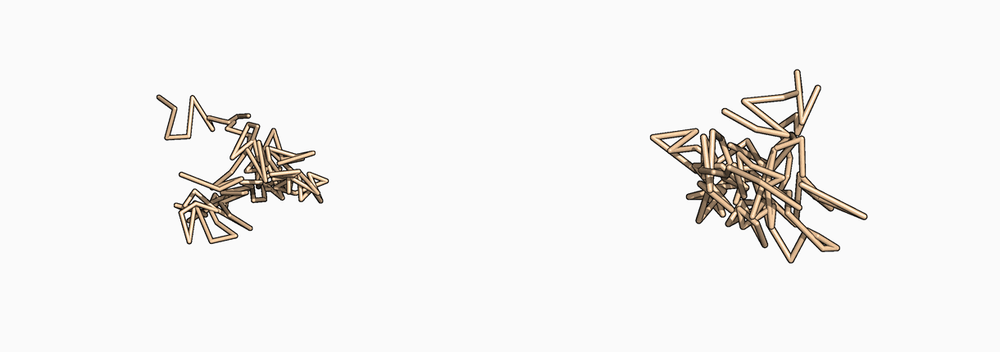

<p align="center">
  
</p>

# equimol

E(n)-equivariant neural networks and diffusion models for molecular and protein geometry.

[Documentation](#documentation) | [Examples](#examples) | [Citing](#citing)

`equimol` is a PyTorch-native research toolkit for geometric deep learning over molecular graphs, protein backbones, and trajectories. It includes EGNN-style layers, molecular/protein graph utilities, regression trainers, and coordinate diffusion examples.

## Example

```python
import torch

from equimol.graphs import fully_connected_edges
from equimol.layers import GaussianRadialBasis
from equimol.models import EGNNRegressor

h = torch.randn(8, 16)
x = torch.randn(8, 3)
edge_index = fully_connected_edges(8)

rbf = GaussianRadialBasis(num_basis=32, cutoff=10.0)
edge_attr = rbf(x, edge_index)

model = EGNNRegressor(
    node_feat_dim=16,
    hidden_dim=128,
    num_layers=4,
    edge_attr_dim=32,
    pooling="mean",
)

y = model(h, x, edge_index, edge_attr=edge_attr)
```

## Installation

```bash
uv sync --group dev
uv run pytest -q
```

For CUDA training, install a CUDA-enabled PyTorch build in the local environment before running the trainers.

## Examples

```bash
uv run python examples/trainers/qm9_regression.py --datapath data/qm9 --target mu
uv run python examples/trainers/md17_regression.py --datapath data/md17 --molecule aspirin
uv run python examples/trainers/protein_backbone_denoiser.py --pdb-dir data/cath/dompdb
uv run python examples/samplers/protein_backbone_denoise.py --help
```

## Current Capabilities

- EGNN, attentive EGNN, VectorEGNN, and early IrrepEGNN components
- QM9 molecular regression
- MD17 energy/force regression
- molecular and protein graph utilities
- coordinate diffusion for protein backbone denoising
- PyMOL-backed protein denoising visualizations

## Documentation

Detailed documentation is in progress.

## Status

`equimol` is experimental research software. APIs, examples, and checkpoints may change quickly.

## Citing

Citation metadata is in progress. For now, cite the repository URL if you use `equimol` in early work.

## References

- Satorras, Hoogeboom, and Welling. E(n) Equivariant Graph Neural Networks.
- Geiger and Smidt. e3nn: Euclidean Neural Networks.
- Wu et al. FoldingDiff.
